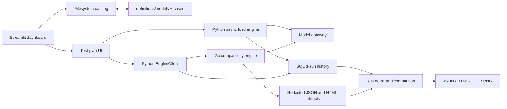

# llm-studio

[English](README.md) | [简体中文](README.zh-CN.md)

llm-studio is a standalone validation workspace for OpenAI-compatible model gateways. It combines a Streamlit dashboard, an asynchronous Python load generator, and a Go compatibility-engine executable so model profiles, protocol cases, live results, and reviewable reports can be managed in one repository.

The current implementation covers three test paths:

- performance testing for text, image, and video chat-completion requests;
- compatibility audits for OpenAI Chat and Kimi K3 behavior;
- Seedance task admission, polling, and result checks.

The [current functional requirements](doc/functional-requirements.md) are derived from the implemented code and tests. They describe the supported workflows, acceptance criteria, security rules, and current non-goals.

## What the dashboard provides

| Area | Current capability |
| --- | --- |
| Overview | Model and case counts, combined run count, local database size, recent performance runs, latency trend, and protocol coverage |
| Models | Create and edit versioned model profiles without storing credentials |
| Test Cases | Browse, filter, create, and edit protocol-specific JSON cases |
| Test Plans | Run performance, OpenAI Chat, Kimi K3, and Seedance plans with live progress |
| Runs | Inspect saved request-level evidence, compare performance runs, and download reports |

Important behavior:

- model profiles and cases are reviewable JSON files under version control;
- API keys are supplied for one run, passed to the request client or Go child process at runtime, and excluded from persisted configuration;
- performance runs support streaming and non-streaming requests, timed dispatch, a connection cap, per-request timeouts, and optional image/video fixtures;
- compatibility runs default to dry-run mode and can select default, explicit, or all cases;
- live multi-task Seedance runs require an explicit paid-suite confirmation;
- performance history and compatibility history share one local SQLite database;
- performance reports export JSON, standalone HTML, PDF, and clipboard-ready PNG; audit reports export JSON and standalone HTML.

## Architecture



The main boundaries are:

- `app.py` and `llm_studio/app_shell.py` — Streamlit entry point and five-page navigation;
- `llm_studio/pages/` — dashboard workflows for overview, catalogs, plans, and history;
- `llm_studio/catalog.py` — validation and atomic filesystem updates for models and cases;
- `loadtest.py` — asynchronous OpenAI-compatible performance requests;
- `llm_studio/engine_client.py` — build and JSONL process boundary for the Go engine;
- `engine/` — case loading, protocol execution, evaluation, redaction, and audit report generation;
- `llm_studio/storage.py` and `llm_studio/audit_storage.py` — local persistence;
- `report_export.py` — performance report rendering.

## Requirements

- Python 3.10 or newer;
- Go 1.22 or newer for compatibility and Seedance audits;
- network access to the gateway being tested;
- Bash, `curl`, `jq`, `awk`, `grep`, `sed`, and `mktemp` for the standalone benchmark script.

## Setup

POSIX shell:

```bash
python3 -m venv .venv
source .venv/bin/activate
python -m pip install -r requirements.txt
```

PowerShell:

```powershell
py -m venv .venv
.\.venv\Scripts\Activate.ps1
python -m pip install -r requirements.txt
```

The compatibility engine is built from the repository-wide Go module on first use when its managed binary is absent or stale. The executable remains under `engine/bin/` and does not depend on a `new-api` checkout.

## Run the dashboard

```bash
streamlit run app.py
```

Open [http://127.0.0.1:8501/](http://127.0.0.1:8501/) after startup.

A typical first run is:

1. Open **Models** and set the endpoint on an existing profile or create a profile.
2. Review the versioned suite under **Test Cases**.
3. Open **Test Plans** and choose Performance, Compatibility, or Seedance.
4. Keep a compatibility or Seedance plan in dry-run mode first to inspect its request plan.
5. Supply the API key only when starting the run.
6. Review saved evidence and exports under **Runs**.

## Model and case files

Model profiles live in `definitions/models/<id>.json`. The required schema is:

```json
{
  "schema_version": 1,
  "id": "example-model",
  "display_name": "Example Model",
  "model": "provider-model-id",
  "protocol": "openai-chat",
  "endpoint": "https://gateway.example/v1/chat/completions",
  "suites": ["openai-chat"],
  "capabilities": ["streaming", "tools"],
  "enabled": true
}
```

Supported profile protocols are `openai-chat`, `kimi-k3`, and `seedance`. Profile IDs are also filenames, so IDs are restricted to letters, digits, `.`, `_`, and `-`. Any API-key-like field at any depth is rejected before a profile is written.

Cases live at `cases/<protocol>/<case-directory>/case.json` and retain their suite directory when edited. Every case requires `id`, `name`, `dimension`, `protocol`, `kind`, and a JSON object named `request`. Optional fields such as `default`, `disabled`, `severity`, and `options` control selection and runner-specific evaluation.

## Performance testing semantics

The dashboard distributes the configured request count across a fixed dispatch window. Optional random distribution adds a small jitter within each interval. A semaphore and the HTTP connector enforce the connection cap, so requests that are ready but waiting for a slot record queue time separately from request time.

For each request the application records, when available:

- HTTP status and client/timeout errors;
- end-to-end latency, TTFT, TPOT, and queue time;
- prompt, completion, and cached tokens;
- stream chunk count and relative start/completion times.

Aggregate metrics include success rate, failures, timeouts, peak in-flight requests, QPS/RPM, input/output/total TPM, generation TPS, cache rate, and P50/P90/P95/P99 latency percentiles.

Each run stores one complete request template. Per-request rows store timing/token metrics and only the top-level request delta. Raw response retention is controlled by one of four policies:

- `errors_and_sample` — failures plus the first N request samples (default);
- `errors_only`;
- `none`;
- `all`.

Large Base64 media values are replaced by length markers in recorded requests while preserving the request shape.

## Compatibility and Seedance audits

The Go engine supports `list` and `run` commands for the `openai-chat`, `kimi-k3`, and `seedance` suites. The dashboard consumes its JSONL event stream:

- `plan` describes the concrete case/model runs;
- `progress` carries one redacted case result;
- `final` carries the report paths, summary, overall status, and verdict.

OpenAI Chat and Kimi K3 live cases can run concurrently from 1 to 32 workers. Seedance runs remain single-worker and can optionally return without polling to terminal task state. The engine requires an absolute HTTPS gateway URL, accepts live credentials only through the named child-process environment variable, and redacts secrets before emitting or writing evidence.

For direct engine usage, see [engine/README.md](engine/README.md).

## Standalone CLI workflows

The legacy Python entry points use environment variables rather than checked-in credentials:

```bash
export LOADTEST_API_KEY="..."
export LOADTEST_URL="https://example.com/v1/chat/completions"
export LOADTEST_MODEL="your-model"

python run_100_test.py
python run_multimodal.py
python run_video_test.py
```

`KIMI_K3_API_KEY` remains supported by `run_100_test.py` for compatibility with its existing workflow.

For terminal-only streaming benchmarks, use `scripts/llm_benchmark.sh`:

```bash
LLM_API_KEY="..." ./scripts/llm_benchmark.sh \
  --api-base https://example.com/v1 \
  --model your-model \
  --num-requests 200 \
  --concurrency 50 \
  --input-token 1000 \
  --output-token 100 \
  --duration 120 \
  --send-duration 60 \
  --output-file results.json
```

`--duration` is the timeout for each request. `--send-duration` is the target window for issuing all requests. When the send duration is greater than zero, the script uses open-loop timed dispatch and continues draining in-flight requests after the window closes; in this mode `--concurrency` does not cap in-flight work. The script writes per-request artifacts, a combined result JSON file, and a sibling summary JSON file while showing live success, TTFT, and TPOT percentiles.

The local SSE mock and integration test are intended for script development:

```bash
bash scripts/test_llm_benchmark.sh
```

`scripts/import-tencent-tokenhub-video-prices.ps1` is an optional administration helper for a compatible Tencent TokenHub/new-api deployment. It requires an explicit pricing JSON file and either access-token or username/password environment variables. Without `-Apply` it only verifies that the configured `ModelPrice` values already match; with `-Apply` it updates and then re-reads them.

## Run the tests

Python suite:

```bash
python -m unittest discover -v
```

Repository-wide Go module and standalone compatibility executable:

```bash
GOWORK=off go test ./...
GOWORK=off go build ./engine/cmd/llm-compat-engine
```

Shell benchmark integration:

```bash
bash scripts/test_llm_benchmark.sh
```

### Current Windows test limitations

The Go process boundary and its integration tests are platform-neutral, including explicit UTF-8 JSONL decoding. One known Windows portability gap remains in audit-history persistence: a report created on a different drive from the repository cannot yet be represented as a relative path. Treat that failing test as a known gap until artifact paths gain an external-location representation.

## Project structure

```text
app.py                       Streamlit entry point
llm_studio/app_shell.py      Navigation and application shell
llm_studio/pages/            Overview, models, cases, plans, and runs
llm_studio/catalog.py        Model and case filesystem catalog
llm_studio/storage.py        Performance-run persistence
llm_studio/audit_storage.py  Compatibility and Seedance persistence
llm_studio/metrics.py        Shared performance calculations
llm_studio/engine_client.py  Python boundary for the Go engine
loadtest.py                  Async performance request engine
report_export.py             HTML, PDF, and PNG performance exports
engine/                      Standalone compatibility engine
definitions/models/         Versioned model profiles
cases/                       Versioned test definitions
fixtures/                    Deterministic image and video inputs
scripts/                     Shell benchmark, mock server, and admin helper
doc/                         Product and functional documentation
data/artifacts/              Ignored, redacted local audit artifacts
loadtest_history.db          Ignored local SQLite history
```

## Local data and security

`loadtest_history.db`, `data/`, and generated result JSON files are intentionally ignored by Git. Deterministic media under `fixtures/`, model profiles under `definitions/`, and protocol suites under `cases/` are project-owned inputs.

Credentials must remain runtime-only:

- do not add API keys to model profiles, cases, examples, or reports;
- prefer the documented environment variables for CLI runs;
- treat saved request/response evidence as sensitive even after key redaction;
- review generated artifacts before sharing them outside the test environment.
