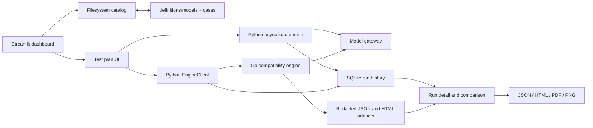

# llm-studio

[English](README.md) | [简体中文](README.zh-CN.md)

llm-studio 是一个面向 OpenAI 兼容模型网关的独立验证工作区。它集成了 Streamlit 仪表盘、异步 Python 负载生成器和 Go 兼容性引擎可执行文件，使模型配置、协议用例、实时结果和可审查报告能够在同一个仓库中统一管理。

当前实现覆盖三类测试路径：

- 文本、图像和视频聊天补全请求的性能测试；
- OpenAI Chat 和 Kimi K3 行为的兼容性审计；
- Seedance 任务准入、轮询和结果检查。

[当前功能需求](doc/functional-requirements.md)基于已实现的代码和测试整理，描述了受支持的工作流、验收标准、安全规则和当前非目标。

## 仪表盘功能

| 区域 | 当前能力 |
| --- | --- |
| Overview | 模型和用例数量、总运行次数、本地数据库大小、近期性能运行、延迟趋势和协议覆盖率 |
| Models | 创建和编辑版本化模型配置，且不存储凭据 |
| Test Cases | 浏览、筛选、创建和编辑特定协议的 JSON 用例 |
| Test Plans | 运行性能、OpenAI Chat、Kimi K3 和 Seedance 计划，并查看实时进度 |
| Runs | 检查已保存的请求级证据、比较性能运行并下载报告 |

重要行为：

- 模型配置和用例均为纳入版本控制、可审查的 JSON 文件；
- API 密钥仅为单次运行提供，在运行时传给请求客户端或 Go 子进程，不会写入持久化配置；
- 性能运行支持流式和非流式请求、定时发送、连接数上限、单请求超时以及可选的图像/视频夹具；
- 兼容性运行默认使用 dry-run 模式，可选择默认用例、显式指定的用例或全部用例；
- 实时多任务 Seedance 运行需要显式确认付费测试套件；
- 性能历史和兼容性历史共用一个本地 SQLite 数据库；
- 性能报告可导出为 JSON、独立 HTML、PDF 和适合复制到剪贴板的 PNG；审计报告可导出为 JSON 和独立 HTML。

## 架构



主要边界如下：

- `app.py` 和 `llm_studio/app_shell.py` — Streamlit 入口和五页面导航；
- `llm_studio/pages/` — 概览、目录、计划和历史记录等仪表盘工作流；
- `llm_studio/catalog.py` — 模型和用例的校验及原子文件系统更新；
- `loadtest.py` — 异步 OpenAI 兼容性能请求；
- `llm_studio/engine_client.py` — Go 引擎的构建和 JSONL 进程边界；
- `engine/` — 用例加载、协议执行、评估、脱敏和审计报告生成；
- `llm_studio/storage.py` 和 `llm_studio/audit_storage.py` — 本地持久化；
- `report_export.py` — 性能报告渲染。

## 环境要求

- Python 3.10 或更高版本；
- 运行兼容性和 Seedance 审计需要 Go 1.22 或更高版本；
- 能够通过网络访问待测试网关；
- 独立基准测试脚本需要 Bash、`curl`、`jq`、`awk`、`grep`、`sed` 和 `mktemp`。

## 安装

POSIX shell：

```bash
python3 -m venv .venv
source .venv/bin/activate
python -m pip install -r requirements.txt
```

PowerShell：

```powershell
py -m venv .venv
.\.venv\Scripts\Activate.ps1
python -m pip install -r requirements.txt
```

当托管二进制文件不存在或已过期时，兼容性引擎会在首次使用时从仓库级 Go module 构建。可执行文件仍位于 `engine/bin/`，且不依赖 `new-api` 工作区。

## 运行仪表盘

```bash
streamlit run app.py
```

启动后打开 [http://127.0.0.1:8501/](http://127.0.0.1:8501/)。

典型的首次运行流程如下：

1. 打开 **Models**，为现有配置设置端点，或创建新配置。
2. 在 **Test Cases** 中检查版本化测试套件。
3. 打开 **Test Plans**，选择 Performance、Compatibility 或 Seedance。
4. 首先让兼容性或 Seedance 计划保持 dry-run 模式，以检查具体请求计划。
5. 仅在开始运行时提供 API 密钥。
6. 在 **Runs** 中查看已保存的证据和导出内容。

## 模型和用例文件

模型配置位于 `definitions/models/<id>.json`。必需的 schema 如下：

```json
{
  "schema_version": 1,
  "id": "example-model",
  "display_name": "Example Model",
  "model": "provider-model-id",
  "protocol": "openai-chat",
  "endpoint": "https://gateway.example/v1/chat/completions",
  "suites": ["openai-chat"],
  "capabilities": ["streaming", "tools"],
  "enabled": true
}
```

支持的配置协议为 `openai-chat`、`kimi-k3` 和 `seedance`。配置 ID 同时也是文件名，因此只能包含字母、数字、`.`、`_` 和 `-`。写入配置前，任何层级中疑似 API 密钥的字段都会被拒绝。

用例位于 `cases/<protocol>/<case-directory>/case.json`，编辑后仍保留其测试套件目录。每个用例都必须包含 `id`、`name`、`dimension`、`protocol`、`kind`，以及名为 `request` 的 JSON 对象。`default`、`disabled`、`severity` 和 `options` 等可选字段用于控制用例选择和运行器特定的评估行为。

## 性能测试语义

仪表盘会将配置的请求数量分布到固定的发送窗口内。可选的随机分布会在每个间隔内加入少量抖动。信号量和 HTTP 连接器共同执行连接数上限，因此已准备就绪但仍在等待可用连接槽的请求，会单独记录排队时间和请求时间。

对于每个请求，应用会在数据可用时记录：

- HTTP 状态以及客户端错误或超时错误；
- 端到端延迟、TTFT、TPOT 和排队时间；
- prompt、completion 和 cached token 数量；
- 流式 chunk 数量，以及相对开始和完成时间。

聚合指标包括成功率、失败数、超时数、峰值在途请求数、QPS/RPM、输入/输出/总 TPM、生成 TPS、缓存率，以及 P50/P90/P95/P99 延迟百分位。

每次运行保存一个完整的请求模板。单请求记录仅保存计时/token 指标和顶层请求差异。原始响应的保留行为由以下四种策略之一控制：

- `errors_and_sample` — 失败请求加前 N 个请求样本（默认）；
- `errors_only`；
- `none`；
- `all`。

记录请求时，大型 Base64 媒体值会替换为长度标记，同时保留请求结构。

## 兼容性和 Seedance 审计

Go 引擎支持对 `openai-chat`、`kimi-k3` 和 `seedance` 测试套件执行 `list` 和 `run` 命令。仪表盘消费其 JSONL 事件流：

- `plan` 描述具体的用例/模型运行；
- `progress` 携带一条已脱敏的用例结果；
- `final` 携带报告路径、摘要、整体状态和判定结果。

OpenAI Chat 和 Kimi K3 实时用例可由 1 到 32 个 worker 并发运行。Seedance 运行保持单 worker，并可选择不轮询至任务终态便提前返回。引擎要求使用绝对 HTTPS 网关 URL，仅通过指定的子进程环境变量接受实时凭据，并在输出或写入证据前对秘密信息进行脱敏。

有关引擎的直接用法，请参阅 [engine/README.md](engine/README.md)。

## 独立 CLI 工作流

旧版 Python 入口使用环境变量，而不是将凭据提交到仓库：

```bash
export LOADTEST_API_KEY="..."
export LOADTEST_URL="https://example.com/v1/chat/completions"
export LOADTEST_MODEL="your-model"

python run_100_test.py
python run_multimodal.py
python run_video_test.py
```

为兼容现有工作流，`run_100_test.py` 仍支持 `KIMI_K3_API_KEY`。

若只需在终端运行流式基准测试，请使用 `scripts/llm_benchmark.sh`：

```bash
LLM_API_KEY="..." ./scripts/llm_benchmark.sh \
  --api-base https://example.com/v1 \
  --model your-model \
  --num-requests 200 \
  --concurrency 50 \
  --input-token 1000 \
  --output-token 100 \
  --duration 120 \
  --send-duration 60 \
  --output-file results.json
```

`--duration` 是单个请求的超时时间。`--send-duration` 是发出全部请求的目标时间窗口。当发送时长大于零时，脚本使用开放循环定时发送，并在发送窗口关闭后继续排空在途请求；在此模式下，`--concurrency` 不限制在途工作数。脚本会写入单请求产物、合并结果 JSON 文件及同级摘要 JSON 文件，同时实时显示成功率、TTFT 和 TPOT 百分位。

本地 SSE mock 和集成测试用于脚本开发：

```bash
bash scripts/test_llm_benchmark.sh
```

`scripts/import-tencent-tokenhub-video-prices.ps1` 是用于兼容 Tencent TokenHub/new-api 部署的可选管理辅助脚本。它需要显式指定定价 JSON 文件，并通过环境变量提供 access token 或用户名/密码。未使用 `-Apply` 时，它只验证配置的 `ModelPrice` 值是否已经匹配；使用 `-Apply` 时，它会更新这些值并重新读取以确认结果。

## 运行测试

Python 测试套件：

```bash
python -m unittest discover -v
```

仓库级 Go module 与独立兼容性可执行文件：

```bash
GOWORK=off go test ./...
GOWORK=off go build ./engine/cmd/llm-compat-engine
```

Shell 基准测试集成：

```bash
bash scripts/test_llm_benchmark.sh
```

### 当前 Windows 测试限制

Go 进程边界及其集成测试现已跨平台，并显式使用 UTF-8 解码 JSONL。目前仍有一个已知 Windows 缺口：当审计报告位于与仓库不同的盘符时，历史持久化还不能把它表示为相对路径。在 artifact 路径支持外部位置之前，应将该失败测试视为已知缺口。

## 项目结构

```text
app.py                       Streamlit 入口
llm_studio/app_shell.py      导航和应用外壳
llm_studio/pages/            概览、模型、用例、计划和运行记录
llm_studio/catalog.py        模型和用例文件系统目录
llm_studio/storage.py        性能运行持久化
llm_studio/audit_storage.py  兼容性和 Seedance 持久化
llm_studio/metrics.py        共享性能计算
llm_studio/engine_client.py  Go 引擎的 Python 边界
loadtest.py                  异步性能请求引擎
report_export.py             HTML、PDF 和 PNG 性能导出
engine/                      独立兼容性引擎
definitions/models/         版本化模型配置
cases/                       版本化测试定义
fixtures/                    确定性的图像和视频输入
scripts/                     Shell 基准测试、mock 服务器和管理辅助脚本
doc/                         产品和功能文档
data/artifacts/              被忽略的本地脱敏审计产物
loadtest_history.db          被忽略的本地 SQLite 历史记录
```

## 本地数据与安全

`loadtest_history.db`、`data/` 和生成的结果 JSON 文件会被 Git 有意忽略。`fixtures/` 下的确定性媒体文件、`definitions/` 下的模型配置以及 `cases/` 下的协议测试套件属于项目输入。

凭据必须仅存在于运行时：

- 不要将 API 密钥添加到模型配置、用例、示例或报告中；
- CLI 运行优先使用文档中说明的环境变量；
- 即使密钥已脱敏，仍应将保存的请求/响应证据视为敏感数据；
- 与外部环境分享生成产物前应先进行审查。
