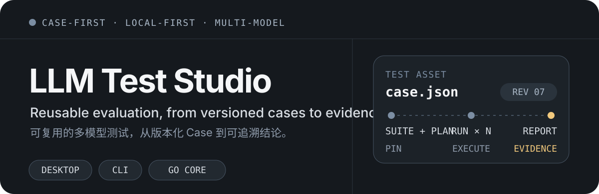
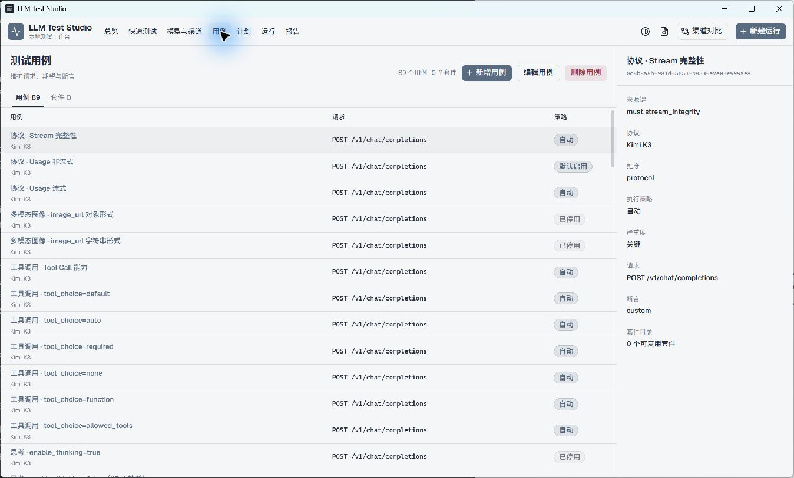

<p align="right">
  <a href="README.md">English</a> · <strong>简体中文</strong>
</p>

<p align="center">
  
</p>

<p align="center">
  <strong>面向 LLM 服务商、AI 网关与私有化部署的本地优先渠道验收与基准测试平台。</strong><br>
  在每条渠道上运行同一组版本化测试，验证兼容性与性能，并为每个上线结论保留可复核证据。
</p>

<p align="center">
  <code>Wails + React 桌面端</code> · <code>Go CLI</code> · <code>SQLite</code> · <code>操作系统凭据存储</code>
</p>

> [!NOTE]
> LLM Test Studio 采用 Apache-2.0 许可证，目前正在为首次公开开源发布做准备。

## 产品实证

<p align="center">
  
</p>

<p align="center"><sub>真实 Windows 桌面构建 · 89 个内置 Case · 不是概念稿或生成式 UI</sub></p>

Case 目录是产品的中心，而不是藏在一次运行背后的配置页面。Case 是可检查、可修订的长期资产，可以组合为 Suite 和 Plan，在不同服务商或网关 Endpoint 上执行，并一路追溯到最终报告。

## 在投入生产前验收渠道

一次成功的 HTTP 响应，并不能证明某个 LLM Endpoint 已经适合承载生产流量。同一个逻辑模型在不同服务商、网关、地域或私有化部署上的实际行为可能不同。LLM Test Studio 将这种不确定性转换为可重复执行的验收结论：

- **协议兼容性** — 验证请求参数、流式事件、工具调用、多模态输入、Usage 字段和错误行为。
- **能力真实性** — 证明模型或 Endpoint 宣称支持的能力，确实能够满足应用所依赖的行为。
- **负载下的性能** — 通过单次请求、固定并发或开放环流量测量延迟、Token 时序、吞吐、排队延迟和调度压力。
- **运行可靠性** — 区分传输、协议、语义、超时和 SLA 失败，而不是将它们压缩成一个成功率。
- **可审计证据** — 为每个结论固定准确的 Case、目标、负载配置、SLA 和运行环境。

网关负责承载和路由生产流量；LLM Test Studio 负责在上线前，以及服务商、模型、网关或部署发生变化后，验证这些路径。

## 为什么是 Case-first 测试

多数 LLM 测试始于一段 Prompt、一个脚本或一次性的仪表盘运行。这适合探索，却很难复用或在之后审计。LLM Test Studio 将测试定义作为可持续维护的资产：

- **Case 比 Run 更长久** — 请求、预期行为和断言保存在可移植的 `case.json` 文件中。
- **测试意图与基础设施分离** — 逻辑模型映射到每个渠道实际使用的上游模型名，因此同一个 Case 可以测试不同服务商或网关。
- **每次运行都可复现** — Plan、Model、Channel、Case 修订、负载配置、SLA 和环境会固定到不可变快照中。
- **结论保留证据** — 请求结果区分传输、协议、语义与 SLA 失败，再生成统一的封存报告模型。
- **桌面端与自动化语义一致** — Wails 应用和适合脚本调用的 CLI 共用同一个 Go Application Core 与领域规则。

## 从渠道验收到证据

```text
版本化 Test Case ──> Suite ──> Plan ──> 不可变 Run Snapshot
                           目标 + 负载 + SLA          │
                                                       ▼
                                          Result + Evidence ──> Report
```

可复用边界是准确的 Case 修订。Suite 组合这些修订；Plan 将它们绑定到候选渠道、负载行为、超时和 SLA 阈值；Run 在执行前固定完整输入。这样，测试意图就不会与某个恰好承载该模型的服务商 Endpoint 耦合。

## 快速开始

### 使用桌面发行包

前往 [GitHub Releases](https://github.com/894x/llm-test-studio/releases) 查看可用构建。Tag 发行流程已配置为生成 Windows amd64 安装包和压缩包，以及 macOS universal DMG 和 ZIP。目前尚未提供 Linux 桌面发行包。

### 构建桌面应用

要求：Go 1.25+ 并使用 Go 1.26.6 工具链、Node.js 24、pnpm 10.30.3 和 Wails v2.15.0。

```bash
go install github.com/wailsapp/wails/v2/cmd/wails@v2.15.0
wails version

cd apps/desktop/frontend
pnpm install --frozen-lockfile
pnpm test
pnpm build

cd ..
wails build -nosyncgomod
```

桌面开发时使用 `wails dev -nosyncgomod` 代替 `wails build -nosyncgomod`。首次启动后，结构化应用数据会创建在操作系统的用户配置目录下。

### 构建 CLI

```bash
go build -o llm-test-studio ./cmd/llm-test-studio
./llm-test-studio doctor --format human
```

在 Windows PowerShell 中，请使用 `.\llm-test-studio.exe` 运行二进制文件。

<details>
<summary><strong>CLI 示例</strong></summary>

列出内置 Kimi K3 Case：

```bash
go run ./cmd/llm-test-studio audit list \
  --suite kimi-k3 \
  --cases-root cases \
  --format human
```

在 Bash 或其他 POSIX shell 中运行一个兼容性 Case：

```bash
API_AUDIT_API_KEY='replace-me' go run ./cmd/llm-test-studio audit run \
  --suite kimi-k3 \
  --cases-root cases \
  --base-url https://gateway.example/v1 \
  --model kimi-k3 \
  --case F004 \
  --format human
```

运行固定并发负载测试：

```bash
LOADTEST_API_KEY='replace-me' \
LOADTEST_URL='https://gateway.example/v1/chat/completions' \
LOADTEST_MODEL='kimi-k3' \
go run ./cmd/llm-test-studio load run \
  --requests 100 \
  --concurrency 10 \
  --stream \
  --input-tokens 100 \
  --max-tokens 10 \
  --output load-result.json
```

使用 `--rate` 和 `--duration` 配置开放环调度。使用 `--request-file cases/<group>/<case>/case.json` 读取 Case 请求体。默认拒绝明文 HTTP；只有显式指定 `--allow-insecure-loopback` 时才允许 localhost 测试服务器。

不要直接通过命令参数传递凭据，因为 shell 可能把它们保留在历史记录中。Windows PowerShell 用户可以先通过 `$env:VARIABLE_NAME = 'value'` 设置相同变量，再运行命令。

</details>

## 可以运行什么

- 无需预先建立完整 Catalog，即可快速测试 URL、Model 或已保存 Channel。
- 创建和维护内置或用户自定义测试 Case。
- 将准确的 Case 修订组合成可复用的 Suite 和 Plan。
- 使用单次请求、固定并发或开放环负载运行测试，并配置请求超时与 SLA 阈值。
- 通过原生 Go 执行引擎运行 OpenAI Chat、Kimi K3 和 Seedance 兼容性 Case。
- 对同一个逻辑模型选择两个或更多渠道进行比较。
- 查看运行历史、请求级结果、延迟与 Token 指标、失败维度、SLA 结论和环境快照。
- 将同一份报告导出为 JSON、独立 HTML、PNG 或 PDF。
- 通过 CLI 执行兼容性审计和负载测试，并获得稳定的 JSON、JSONL 或人类可读输出。

## 内置 Case 库

仓库目前包含 89 个可移植 Case：

| Case 分组   | 数量 | 重点                                                  |
| ----------- | ---: | ----------------------------------------------------- |
| OpenAI Chat |   43 | Chat 兼容性、流式响应、工具调用、推理、安全和用量行为 |
| Kimi K3     |   40 | Kimi 专属兼容性与能力覆盖                             |
| Seedance    |    6 | 文本、图片、视频和混合参考视频请求                    |

内置 Case 是测试起点，不代表每个 Case 都适用于每个模型。Plan 执行前会验证协议兼容性。

用户 Case 以 `cases/<group>/<case>/case.json` 形式保存在桌面可执行文件旁，可以在不携带 API Key 的情况下复制、审查、版本管理和分享。合并两个来源时，相同身份的用户 Case 会覆盖内置 Case。

## 领域模型

| 概念                    | 含义                                                            |
| ----------------------- | --------------------------------------------------------------- |
| **Model**         | 被测试的逻辑模型，不等同于某个服务商的模型名称。                |
| **Channel**       | 一条可调用的服务路径，包含 Base URL、协议、启用状态和凭据引用。 |
| **Channel Model** | 某个逻辑模型在特定渠道实际使用的上游模型名。                    |
| **Test Case**     | 版本化的请求、预期结果和断言集合。                              |
| **Suite**         | 一组准确 Case 修订组成的可复用集合。                            |
| **Plan**          | 测试意图：Case、候选目标、负载配置和 SLA 阈值。                 |
| **Run**           | 一次带有不可变输入快照的执行。                                  |
| **Report**        | JSON、HTML、PNG 和 PDF 导出共同使用的、经过验证的结论。         |

## 架构

```text
Wails + React desktop ──┐
                        ├── Go Application Core ──┬── 执行引擎
llm-test-studio CLI ────┘                         ├── SQLite repository
                                                  ├── 操作系统凭据存储
                                                  ├── 文件系统 Case 目录
                                                  └── 报告渲染器
```

桌面端与 CLI 共用相同的应用服务和领域规则，不依赖 Python 或 Streamlit 运行时。

<details>
<summary><strong>仓库目录</strong></summary>

- `apps/desktop` — Wails binding 与 React/Tailwind 桌面界面。
- `cmd/llm-test-studio` — 具有版本协议的 CLI 命令与 JSON/JSONL 输出。
- `internal/application` — 目录、运行、对比、报告和工作区编排。
- `internal/execution` 与 `engine` — 负载和兼容性执行引擎。
- `internal/persistence/sqlite` — Schema migration 与 repository。
- `cases` — 按协议分组的内置可分享 Case。
- `definitions` — 不含秘密的模型定义 fixture。

</details>

## 安全与本地数据

- 测试定义会拒绝携带凭据的 Header、凭据字段和类似凭据的值。
- Channel Key 通过操作系统凭据服务保存；更新 Key 会创建新的凭据修订。
- 持久化应用数据只包含凭据引用、脱敏后缀和指纹，不包含明文秘密。
- 报告与结果只包含测量数据和脱敏证据元数据，不包含 Authorization Header 或凭据字节。
- SQLite 保存目录实体、固定快照、Run、Result、Comparison 和封存 Report；可移植 Case 继续作为文件系统资产保存。
- 默认拒绝明文 HTTP Endpoint，显式启用的 loopback 测试除外。

## 当前范围

- LLM Test Studio 会直接调用并验证配置的 Endpoint；它不是生产流量网关、路由器或服务商 SDK。
- 产品聚焦 Endpoint 验收和对比证据，不负责维护公共模型排行榜，也不分析 API 边界以下的推理硬件性能。
- 专用 Comparison 工作流用于比较同一个逻辑模型的多个渠道；任意模型与渠道的完整矩阵目前还不是一级工作流。
- Case 复用遵守协议兼容性，不能把 Case 绑定到不兼容的 Model 或 Channel。
- 已配置的桌面发行目标是 Windows amd64 和 macOS universal。Wails 支持的其他平台可以尝试从源码构建。

## 验证源码 Checkout

```bash
go test ./... -count=1
go vet ./...

cd apps/desktop/frontend
pnpm test
pnpm build
```

旧 Bash benchmark 继续作为独立的负载引擎验收 fixture，其 Mock LLM 已使用 Go 实现：

```bash
bash scripts/test_llm_benchmark.sh
```

## 许可证

LLM Test Studio 源代码、内置 Case 定义和项目自有媒体 fixture 均采用 [Apache License 2.0](LICENSE)。归属和授权范围详见 [NOTICE](NOTICE)、[第三方声明](THIRD_PARTY_NOTICES.md)与 [Case 及媒体来源声明](cases/PROVENANCE.md)。

## 开源状态

公开发布准备仍在进行中。许可证、贡献指南、安全报告渠道、仓库模板以及首轮源码与 Git 历史秘密扫描已经覆盖；剩余发布门禁主要是替换或稳定外部托管的媒体 fixture，并确定公开桌面二进制文件的签名与公证方案。
